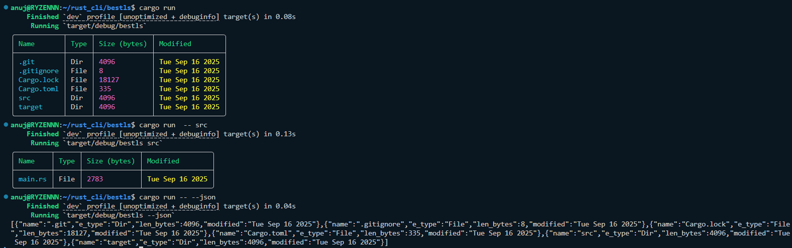

# BestLS - A Better Directory Listing Tool

A fast and beautiful command-line directory listing tool written in Rust. BestLS enhances the traditional `ls` command with colorized output, tabular formatting, and JSON export capabilities.

## Features

- **Colorized Output**: Files and directories are displayed with color-coded formatting for better readability
- **Tabular Display**: Clean, rounded table format showing file names, types, sizes, and modification dates
- **JSON Export**: Export directory contents as structured JSON data with the `--json` flag
- **Cross-Platform**: Built with Rust for reliable performance across different operating systems
- **Simple Interface**: Easy-to-use command-line interface with optional path specification

## Usage

```bash
# List current directory
bestls

# List specific directory
bestls /path/to/directory

# Export as JSON
bestls --json
bestls /path/to/directory --json
```

## Screenshot



*Add your screenshot here showing the colorized tabular output*

## Installation

```bash
# Clone and build from source
git clone <your-repo-url>
cd bestls
cargo build --release

# The binary will be available at target/release/bestls
```

## Dependencies

Built with modern Rust libraries:
- `clap` - Command-line argument parsing
- `tabled` - Beautiful table formatting
- `owo-colors` - Terminal color support
- `chrono` - Date and time handling
- `serde` - JSON serialization

